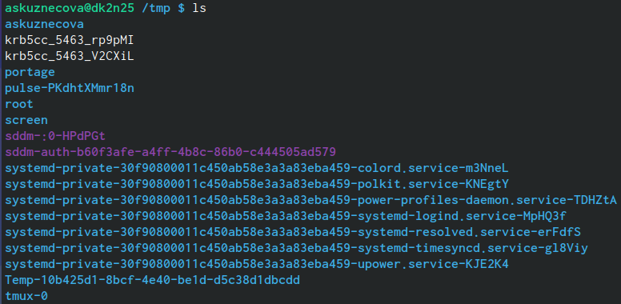
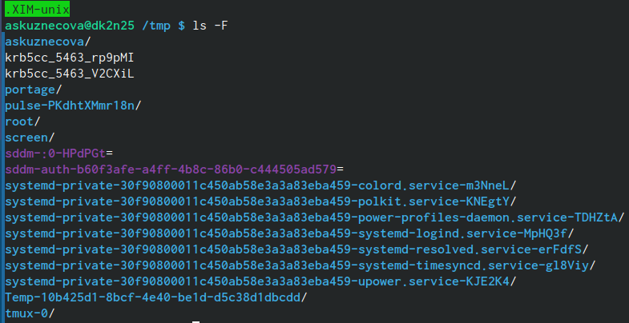
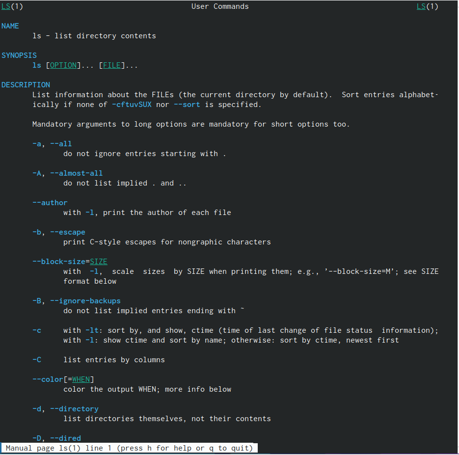
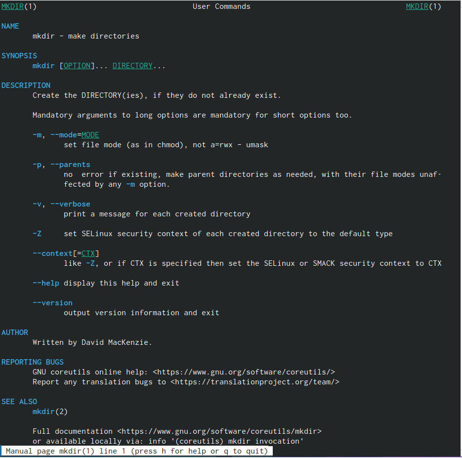
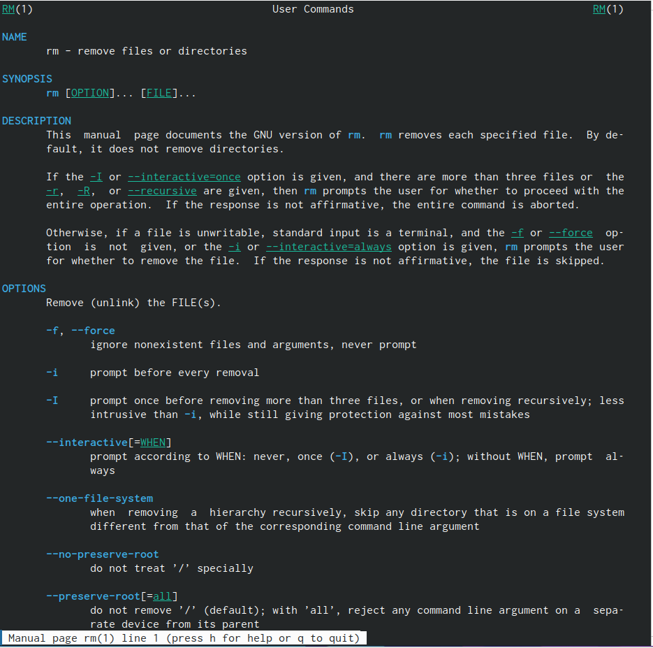
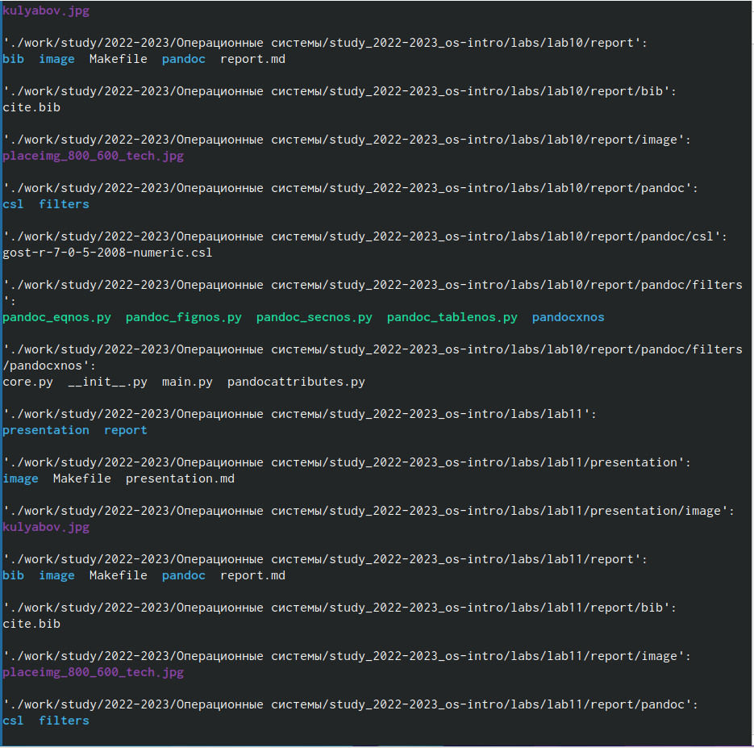

---
## Front matter
title: Лабораторная работа №4
subtitle: "Основы интерфейса взаимодействия
пользователя с системой Unix на уровне командной строки"
author: "Кузнецова Александра"

## i18n babel
babel-lang: russian
babel-otherlangs: english

## Formatting pdf
toc: false
toc-title: Содержание
slide_level: 2
aspectratio: 169
section-titles: true
theme: metropolis
header-includes:
 - \metroset{progressbar=frametitle,sectionpage=progressbar,numbering=fraction}
 - '\makeatletter'
 - '\beamer@ignorenonframefalse'
 - '\makeatother'
---

# Информация

## Докладчик

:::::::::::::: {.columns align=center}
::: {.column width="70%"}

  * Дашкина Анита
  * студентка НБИбд-03-23
  * Российский университет дружбы народов

:::
::: {.column width="30%"}

:::
::::::::::::::

# Вводная часть
 
## Вводная часть 
 В операционной системе типа Linux взаимодействие пользователя с системой обычно
осуществляется с помощью командной строки посредством построчного ввода ко-
манд. При этом обычно используется командные интерпретаторы языка shell: /bin/sh;
/bin/csh; /bin/ksh.
 Формат команды. Командой в операционной системе называется записанный по
специальным правилам текст (возможно с аргументами), представляющий собой ука-
зание на выполнение какой-либо функций (или действий) в операционной системе.
Обычно первым словом идёт имя команды, остальной текст — аргументы или опции,
конкретизирующие действие.

## Объект и предмет исследования

- Команда man
- Команда cd
- Команда pwd
- Команда ls
- Команда mkdir
- Команда rm
- Команда history

# Цель работы

## Цель работы

   Целью лабораторной работы является приобретение практических навыков взаимодействия пользователя с системой по-
средством командной строки.

# Выполнение лабораторной работы

# Первый этап

## 1
   Определим полное имя вашего домашнего каталога. Далее относительно этого каталога 
будут выполняться последующие упражнения.

{#fig:001 width=70%}

# Второй этап

## 2.1 
   Перейдём в каталог /tmp

{#fig:002 width=70%}

## 2.2
   Выведем на экран содержимое каталога /tmp с помощью команды ls

{#fig:003 width=50%}
  
#  Сравним команды ls -a и ls -F

## ls -a
 Команда ls с опцией -a отображает имена скрытых файлов

{#fig:004 width=40%} 

## ls -F 
Команда ls с опцией -F  даёт информацию о типах файлов

{#fig:005 width=50%}
  

## 2.3
 Определим, есть ли в каталоге /var/spool подкаталог с именем cron

{#fig:006 width=70%}

## 2.4 
 Переходим в домашний каталог и выводим на экран его содержимое. 

{#fig:007 width=70%}
 
##
 Определим, кто является владельцем файлов и подкаталогов с помоью команды ls -l

{#fig:008 width=70%}

# Третий этап
 
## 3.1
 В домашнем каталоге создаём новый каталог с именем newdir.

{#fig:009 width=70%}

## 3.2
  В каталоге ~/newdir создаём новый каталог с именем morefun.

{#fig:010 width=70%}

## 3.3
 В домашнем каталоге создаём одной командой три новых каталога с именами
letters, memos, misk. Затем удаляем эти каталоги одной командой

{#fig:011 width=70%}
    
## 3.4
 Удалим каталог ~/newdir/morefun из домашнего каталога. Проверьте, был ли
каталог удалён.

{#fig:012 width=70%}

# Четвёртый этап

## 4
 С помощью команды man определяем, какую опцию команды ls нужно использо-
вать для просмотра содержимого не только указанного каталога, но и подкаталогов,
входящих в него.
    
{#fig:013 width=70%}

##

{#fig:014 width=40%}

##

{#fig:015 width=40%}

Нужно использовать команду ls -R

# Пятый этап

## 5

 С помощью команды man определяем набор опций команды ls, позволяющий отсорти-
ровать по времени последнего изменения выводимый список содержимого каталога
с развёрнутым описанием файлов.

## --time-style
{#fig:016 width=40%}

# Шестой этап

## 6

 Используйте команду man для просмотра описания следующих команд: cd, pwd, mkdir,
rmdir, rm. Поясните основные опции этих команд.

## cd

{#fig:017 width=40%}

## pwd

{#fig:018 width=40%}

## mkdir

{#fig:019 width=40%}

## rmdir 

{#fig:020 width=45%}

## rm

{#fig:021 width=40%}

# Седьмой этап
 
## 7
 Получим при помощи команды history

{#fig:022 width=30%}

{#fig:023 width=30%}

## 
 Выполним модификацию и исполнение нескольких команд из буфера команд
    
{#fig:024 width=65%}

{#fig:025 width=62%}

# Вывод

## Выводы

Мы приобрели практические навыки взаимодействия пользователя с системой по-
средством командной строки

